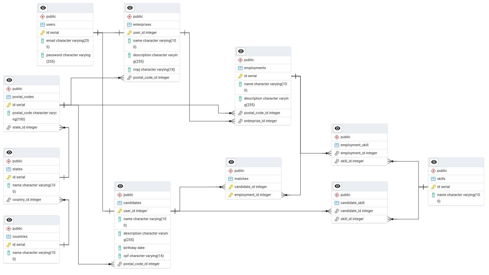

# db_linketinder

Repositório contendo a estrutura do banco de dados relacional (PostgreSQL) do projeto Linketinder, com dados simulados de exemplo e a implementação da funcionalidade de match.

## 📊 Diagrama

**Obs:** Criado com o pgAdmin 4
## 🗃️ Estrutura Principal

### Tabelas Principais
| Tabela             | Descrição                                  |
|---------------------|-------------------------------------------|
| `users`            | Usuários base (candidatos/empresas)       |
| `candidates`       | Detalhes de candidatos                    |
| `enterprises`      | Dados de empresas                         |
| `employments`      | Vagas publicadas                          |
| `skills`           | Habilidades técnicas                      |
| `matches`          | Matches entre candidatos e vagas          |

### Relacionamentos Chave
- **Candidatos** possuem habilidades (`candidate_skill`)
- **Vagas** exigem habilidades (`employment_skill`)
- **Matches** conectam candidatos a vagas
- Hierarquia geográfica: `countries` → `states` → `postal_codes`

## 🚀 Como Usar

1. **Pré-requisitos**
    - PostgreSQL 12+
    - PGAdmin ou outra ferramenta SQL

2. **Executar o Script**
   ```sql
   psql -U seu_usuario -d seu_banco -f db_linketinder.sql
   ```

3. **Dados Iniciais Incluídos**
    - 5 candidatos com habilidades
    - 5 empresas com vagas
    - Todos estados brasileiros
    - 10 habilidades técnicas comuns
    - 5 matches de exemplo


